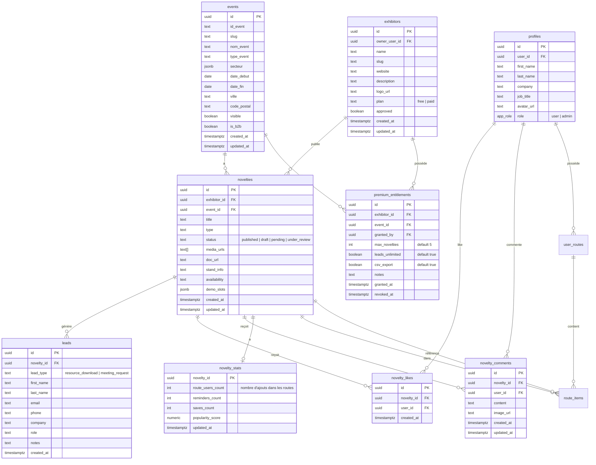

# LotExpo — Audit du système de leads (existant)

**Date de l'audit** : 2025-11-06  
**Version du système** : Production actuelle  
**Périmètre** : Système de leads pré-événement, Espace Exposant, Premium  
**Type** : Lecture seule, sans modification

---

## 1. Résumé exécutif

### 1.1 Fonctionnement actuel

Le système de leads de LotExpo permet aux visiteurs de manifester leur intérêt pour des nouveautés exposées lors de salons professionnels. Il existe deux types de leads :

1. **Téléchargement de brochure** (`resource_download`) : le visiteur télécharge un document PDF
2. **Demande de rendez-vous** (`meeting_request`) : le visiteur demande à être recontacté

Les leads sont capturés via l'Edge Function `leads-create`, stockés dans la table `leads`, et associés à une nouveauté (`novelties`), elle-même liée à un exposant (`exhibitors`) et un événement (`events`).

### 1.2 Système Premium (paywall actuel)

Le système Premium fonctionne selon le modèle suivant :

- **Plan gratuit** : accès aux **3 premiers leads** avec coordonnées complètes, les suivants sont floutés
- **Plan Premium** : 99€ HT par événement, accès illimité à tous les leads + export CSV + jusqu'à 5 nouveautés

**Logique du paywall** :
- Implémentée dans `src/components/novelty/LeadCard.tsx` : floutage visuel des données (`blur-[3px]`) + masquage partiel (`text.slice(0, 2) + '***'`)
- Déterminée par la table `premium_entitlements` : si une ligne existe avec `revoked_at = null` pour `(exhibitor_id, event_id)`, l'exposant est Premium
- Compteur de leads floutés géré dans `src/components/novelty/NoveltyLeadsDisplay.tsx` : les 3 premiers sont visibles, les 3 suivants sont floutés, les autres masqués avec prompt d'upgrade

**Activation Premium** :
- Formulaire de contact dans `PremiumLeadDialog.tsx` → appel à l'Edge Function `premium-lead-submit`
- Activation manuelle par un admin via les Edge Functions `premium-grant` / `premium-revoke`

### 1.3 Points saillants

- ✅ **Séparation claire** des plans gratuit/Premium dans la base (`premium_entitlements`)
- ✅ **Quotas de nouveautés** gérés par table (`useNoveltyQuota` : 1 nouveauté gratuite, jusqu'à 5 en Premium)
- ✅ **Déduplication possible** : pas d'unicité en base pour éviter les doublons (risque de spam)
- ⚠️ **Pas d'analytics** : aucun événement RudderStack/Analytics trouvé dans le code actuel
- ⚠️ **Pas de validation stricte** : pas de constraint `UNIQUE (novelty_id, email)` → possibilité de leads multiples du même visiteur

### 1.4 Zones de risque

- **Spam/Duplication** : aucune contrainte `UNIQUE` sur `(novelty_id, email)` → un même visiteur peut créer plusieurs leads
- **Pas de source de lead** : aucune colonne pour distinguer un lead "pré-événement" d'un lead "sur salon" (futur besoin)
- **RLS laxiste sur `leads`** : les policies permettent aux owners d'exhibitors et aux créateurs de novelties de voir les leads, mais pas de vérification stricte du statut Premium pour l'accès complet

---

## 2. Schéma de données (existant)

### 2.1 Diagramme ERD (Mermaid)



### 2.2 Tables et colonnes détaillées

#### Table : `leads`

| Colonne | Type | Nullable | Default | Contraintes/Index |
|---------|------|----------|---------|-------------------|
| `id` | uuid | NO | `gen_random_uuid()` | PK |
| `novelty_id` | uuid | NO | - | FK → `novelties.id` |
| `lead_type` | text | NO | - | Enum-like: `resource_download`, `meeting_request` |
| `first_name` | text | NO | - | - |
| `last_name` | text | NO | - | - |
| `email` | text | NO | - | ⚠️ Pas d'unicité, risque de duplication |
| `phone` | text | YES | NULL | - |
| `company` | text | YES | NULL | - |
| `role` | text | YES | NULL | - |
| `notes` | text | YES | NULL | - |
| `created_at` | timestamptz | NO | `now()` | Index pour tri chronologique |

**Remarques** :
- ⚠️ Pas de contrainte `UNIQUE (novelty_id, email)` → un visiteur peut créer plusieurs leads pour la même nouveauté
- Pas de colonne `source` ou `captured_at_event` pour distinguer les leads pré/sur salon

#### Table : `novelties`

| Colonne | Type | Nullable | Default | Contraintes |
|---------|------|----------|---------|-------------|
| `id` | uuid | NO | `gen_random_uuid()` | PK |
| `exhibitor_id` | uuid | NO | - | FK → `exhibitors.id` |
| `event_id` | uuid | NO | - | FK → `events.id` |
| `title` | text | NO | - | - |
| `type` | text | NO | - | Enum-like: `Launch`, `Innovation`, `Exclusive` |
| `status` | text | YES | `'published'` | Enum-like: `draft`, `pending`, `published`, `under_review` |
| `reason_1`, `reason_2`, `reason_3` | text | YES | NULL | 3 raisons de visiter |
| `audience_tags` | text[] | YES | NULL | Tags ciblés |
| `media_urls` | text[] | YES | NULL | URLs des images/vidéos |
| `doc_url` | text | YES | NULL | URL de la brochure PDF |
| `stand_info` | text | YES | NULL | Infos sur le stand |
| `availability` | text | YES | NULL | Disponibilité |
| `demo_slots` | jsonb | YES | NULL | Créneaux de démo |
| `created_by` | uuid | YES | NULL | FK → `profiles.user_id` |
| `created_at` | timestamptz | YES | `now()` | - |
| `updated_at` | timestamptz | YES | `now()` | Trigger `update_updated_at_column` |

#### Table : `exhibitors`

| Colonne | Type | Nullable | Default | Contraintes |
|---------|------|----------|---------|-------------|
| `id` | uuid | NO | `gen_random_uuid()` | PK |
| `name` | text | NO | - | - |
| `slug` | text | YES | NULL | Généré par trigger `generate_exhibitor_slug()` |
| `website` | text | YES | NULL | - |
| `description` | text | YES | NULL | - |
| `logo_url` | text | YES | NULL | - |
| `owner_user_id` | uuid | YES | NULL | FK → `profiles.user_id` |
| `plan` | text | YES | `'free'` | Enum-like: `free`, `paid` (⚠️ **Legacy**, remplacé par `premium_entitlements`) |
| `approved` | boolean | YES | `false` | - |
| `created_at` | timestamptz | YES | `now()` | - |
| `updated_at` | timestamptz | YES | `now()` | Trigger `update_updated_at_column` |

**Remarques** :
- La colonne `plan` est legacy : le système Premium actuel utilise la table `premium_entitlements`

#### Table : `premium_entitlements`

| Colonne | Type | Nullable | Default | Contraintes |
|---------|------|----------|---------|-------------|
| `id` | uuid | NO | `gen_random_uuid()` | PK |
| `exhibitor_id` | uuid | NO | - | FK → `exhibitors.id` |
| `event_id` | uuid | NO | - | FK → `events.id` |
| `granted_by` | uuid | NO | - | FK → `profiles.user_id` (admin) |
| `max_novelties` | int | NO | `5` | Nombre max de nouveautés |
| `leads_unlimited` | boolean | NO | `true` | Accès illimité aux leads |
| `csv_export` | boolean | NO | `true` | Export CSV activé |
| `notes` | text | YES | NULL | Notes admin |
| `granted_at` | timestamptz | NO | `now()` | Date d'activation |
| `revoked_at` | timestamptz | YES | NULL | Date de révocation (NULL = actif) |

**Contrainte unique** : `UNIQUE (exhibitor_id, event_id)` (non confirmé par introspection, à vérifier)

**Logique** :
- Un exposant est Premium pour un événement si `premium_entitlements.revoked_at IS NULL`
- RLS : seuls les owners de l'exhibitor et les admins peuvent lire

#### Table : `events`

| Colonne | Type | Nullable | Default | Contraintes |
|---------|------|----------|---------|-------------|
| `id` | uuid | NO | `uuid_generate_v4()` | PK |
| `id_event` | text | NO | - | Identifiant métier |
| `slug` | text | YES | NULL | Généré par trigger `auto_generate_event_slug()` |
| `nom_event` | text | NO | - | - |
| `type_event` | text | YES | NULL | Enum-like: `Salon`, `Congrès`, `Foire` |
| `secteur` | jsonb | YES | `'[]'` | Array de secteurs (ex: `["Mode", "Textile"]`) |
| `date_debut` | date | YES | NULL | - |
| `date_fin` | date | YES | NULL | - |
| `ville` | text | YES | NULL | - |
| `code_postal` | text | YES | NULL | - |
| `visible` | boolean | YES | `false` | Événement publié ou non |
| `is_b2b` | boolean | NO | `false` | B2B ou B2C |
| `created_at` | timestamptz | YES | `now()` | - |
| `updated_at` | timestamptz | YES | `now()` | Trigger `update_updated_at_column` |

#### Table : `novelty_stats`

| Colonne | Type | Nullable | Default | Contraintes |
|---------|------|----------|---------|-------------|
| `novelty_id` | uuid | NO | - | PK, FK → `novelties.id` |
| `route_users_count` | int | YES | `0` | Nombre d'utilisateurs ayant ajouté dans leur route |
| `reminders_count` | int | YES | `0` | - |
| `saves_count` | int | YES | `0` | - |
| `popularity_score` | numeric | YES | `0` | Score calculé : `route_users_count * 3 + reminders_count * 2 + saves_count` |
| `updated_at` | timestamptz | YES | `now()` | - |

**Triggers** : `update_novelty_stats()` (sur `route_items` INSERT/DELETE) met à jour automatiquement `route_users_count` et `popularity_score`

### 2.3 Index, contraintes, enums, policies, triggers

#### Index principaux

- `leads.novelty_id` : index pour jointures rapides
- `novelties.exhibitor_id`, `novelties.event_id` : index pour filtres
- `premium_entitlements(exhibitor_id, event_id)` : recherche d'entitlement actif
- `events.visible`, `events.date_debut` : filtre des événements publiés et à venir

#### Enums (via text + validation applicative)

| Enum logique | Valeurs | Localisation |
|-------------|---------|--------------|
| `lead_type` | `resource_download`, `meeting_request` | `leads.lead_type` |
| `novelty_status` | `draft`, `pending`, `under_review`, `published` | `novelties.status` |
| `exhibitor_plan` | `free`, `paid` (legacy) | `exhibitors.plan` |
| `app_role` | `user`, `admin` | `profiles.role` |

#### RLS Policies (Row-Level Security)

**Table `leads`** :

| Policy | Command | Using | With Check |
|--------|---------|-------|------------|
| Admins can manage all leads | ALL | `is_admin()` | - |
| Exhibitor owners can view their leads | SELECT | `novelty_id IN (SELECT n.id FROM novelties n JOIN exhibitors e ON e.id = n.exhibitor_id WHERE e.owner_user_id = auth.uid())` | - |
| Novelty creators can view their leads | SELECT | `novelty_id IN (SELECT id FROM novelties WHERE created_by = auth.uid())` | - |
| Service role can create leads | INSERT | - | `auth.role() = 'service_role'` |

**Remarques** :
- ⚠️ Pas de vérification du statut Premium dans les policies → le floutage est géré côté frontend uniquement
- Service role nécessaire pour `leads-create` Edge Function

**Table `premium_entitlements`** :

| Policy | Command | Using | With Check |
|--------|---------|-------|------------|
| Admins can manage premium entitlements | ALL | `is_admin()` | `is_admin()` |
| Users can view their entitlements or admins view all | SELECT | `EXISTS (SELECT 1 FROM exhibitors e WHERE e.id = premium_entitlements.exhibitor_id AND e.owner_user_id = auth.uid()) OR is_admin()` | - |

**Table `novelties`** :

| Policy | Command | Using | With Check |
|--------|---------|-------|------------|
| Admins can manage all novelties | ALL | `is_admin()` | `is_admin()` |
| Exhibitor owners can update their novelties | UPDATE | `EXISTS (SELECT 1 FROM exhibitors e WHERE e.id = novelties.exhibitor_id AND e.owner_user_id = auth.uid())` | Same |
| Public read access to published novelties | SELECT | `status = 'published' OR is_admin() OR EXISTS (...)` | - |

#### Triggers

| Trigger | Event | Function | Description |
|---------|-------|----------|-------------|
| `update_updated_at_column` | BEFORE UPDATE | `update_updated_at_column()` | Met à jour `updated_at` sur `novelties`, `exhibitors`, `events` |
| `generate_exhibitor_slug` | BEFORE INSERT OR UPDATE | `generate_exhibitor_slug()` | Génère un slug unique pour les exposants |
| `auto_generate_event_slug` | BEFORE INSERT OR UPDATE | `auto_generate_event_slug()` | Génère un slug unique pour les événements |
| `update_novelty_stats` | AFTER INSERT/DELETE ON `route_items` | `update_novelty_stats()` | Met à jour `novelty_stats.route_users_count` et `popularity_score` |

---

## 3. APIs & Edge Functions

### 3.1 Création de leads

**Endpoint** : `POST /functions/v1/leads-create`

| Propriété | Valeur |
|-----------|--------|
| Fichier | `supabase/functions/leads-create/index.ts` |
| Méthode | POST |
| Auth | Publique (service role interne) |
| Validation | Zod schema |
| Tables lues | `novelties` |
| Tables écrites | `leads` |

**Payload (Zod schema)** :

```typescript
{
  novelty_id: string (uuid),
  lead_type: 'brochure_download' | 'meeting_request',
  first_name: string (min 1),
  last_name: string (min 1),
  email: string (email format),
  company?: string,
  role?: string,
  phone?: string,
  notes?: string
}
```

**Logique** :

1. Valide le payload avec Zod
2. Vérifie que la nouveauté existe et récupère `doc_url`
3. Si `lead_type = 'brochure_download'`, vérifie que `doc_url` est présent
4. Mappe le `lead_type` frontend vers la DB :
   - `'brochure_download'` → `'resource_download'`
   - `'meeting_request'` → `'meeting_request'`
5. Insère dans `leads` avec service role
6. Retourne `{ success: true, lead_id, message, download_url? }`

**Appels sortants** : Aucun (pas de webhook n8n actuellement)

**⚠️ Pas de déduplication** : un même email peut créer plusieurs leads pour la même nouveauté.

---

### 3.2 Récupération des leads d'une nouveauté

**Endpoint** : `POST /functions/v1/novelty-leads`

| Propriété | Valeur |
|-----------|--------|
| Fichier | `supabase/functions/novelty-leads/index.ts` |
| Méthode | POST |
| Auth | Requise (JWT) |
| Tables lues | `novelties`, `exhibitors`, `leads`, `premium_entitlements` |

**Payload** :

```typescript
{
  novelty_id: string (uuid)
}
```

**Logique** :

1. Authentifie l'utilisateur via JWT
2. Récupère la nouveauté et l'exposant associé
3. Vérifie que l'utilisateur est admin, owner de l'exposant, ou créateur de la nouveauté
4. Récupère tous les leads de cette nouveauté
5. Vérifie le statut Premium via `premium_entitlements`
6. **Si non-Premium et non-admin** : masque les données au-delà des 3 premiers leads
7. Retourne `{ leads, total, isPremium }`

**Masquage (non-Premium)** :

```typescript
// Les 3 premiers leads : données complètes
// Au-delà : remplace par { email: "***", phone: "***", ... }
```

---

### 3.3 Activation Premium

**Endpoint** : `POST /functions/v1/premium-grant`

| Propriété | Valeur |
|-----------|--------|
| Fichier | `supabase/functions/premium-grant/index.ts` |
| Méthode | POST |
| Auth | Admin uniquement |
| Tables lues | `profiles`, `premium_entitlements` |
| Tables écrites | `premium_entitlements` (upsert) |

**Payload (Zod schema)** :

```typescript
{
  exhibitor_id: string (uuid),
  event_id: string (uuid),
  max_novelties?: number (default 5),
  leads_unlimited?: boolean (default true),
  csv_export?: boolean (default true),
  notes?: string
}
```

**Logique** :

1. Vérifie que l'utilisateur est admin (via `profiles.role = 'admin'`)
2. Cherche une entrée existante dans `premium_entitlements` pour `(exhibitor_id, event_id)`
3. Si existe : met à jour avec `revoked_at = NULL` (réactivation)
4. Sinon : insère une nouvelle ligne
5. Retourne `{ success: true, data }`

**Appels** : Appelé depuis `usePremiumGrant()` dans `NoveltyModeration.tsx` (interface admin)

---

### 3.4 Révocation Premium

**Endpoint** : `POST /functions/v1/premium-revoke`

| Propriété | Valeur |
|-----------|--------|
| Fichier | `supabase/functions/premium-revoke/index.ts` |
| Méthode | POST |
| Auth | Admin uniquement |
| Tables écrites | `premium_entitlements` (UPDATE) |

**Payload** :

```typescript
{
  exhibitor_id: string (uuid),
  event_id: string (uuid)
}
```

**Logique** :

1. Vérifie que l'utilisateur est admin
2. Met à jour `premium_entitlements.revoked_at = now()` pour `(exhibitor_id, event_id)` où `revoked_at IS NULL`
3. Retourne `{ success: true, data }` ou `404` si aucune entitlement active trouvée

---

### 3.5 Demande de contact Premium

**Endpoint** : `POST /functions/v1/premium-lead-submit`

| Propriété | Valeur |
|-----------|--------|
| Fichier | `supabase/functions/premium-lead-submit/index.ts` |
| Méthode | POST |
| Auth | Publique |
| Tables écrites | (Non spécifié dans le contexte, probablement une table de leads commerciaux) |

**Payload** :

```typescript
{
  firstName: string,
  lastName: string,
  email: string,
  phone: string,
  company: string,
  eventId: string,
  eventName: string,
  eventDate: string,
  eventSlug: string
}
```

**Logique** : Enregistre la demande de contact pour activation Premium. Probablement envoi d'email ou notification Slack/n8n (non confirmé).

---

## 4. Frontend (Espace Exposant)

### 4.1 Structure de navigation

**Page principale** : `src/pages/Agenda.tsx`

| Propriété | Valeur |
|-----------|--------|
| Route | `/agenda` |
| Onglets | Mode Visiteur / Espace Exposant |
| Composants | `VisitorDashboard`, `ExhibitorDashboard` |

**Composant clé** : `src/components/agenda/ExhibitorDashboard.tsx`

| Responsabilité | Détails |
|----------------|---------|
| Affichage | Liste des nouveautés de l'exposant |
| Compteurs | Likes, Téléchargements, Rendez-vous (badges affichés par nouveauté) |
| Leads | Affiche `NoveltyLeadsDisplay` pour chaque nouveauté |
| Edition | Modal `EditNoveltyDialog` pour modifier une nouveauté |

### 4.2 Composants de la logique Premium

#### `src/components/novelty/NoveltyLeadsDisplay.tsx`

| Responsabilité | Implémentation |
|----------------|----------------|
| Récupération des leads | `useQuery` → appel à `POST /novelty-leads` |
| Vérification Premium | `usePremiumEntitlement(exhibitorId, eventId)` |
| Affichage conditionnel | • Leads 1-3 : visibles<br>• Leads 4-6 : floutés<br>• Leads 7+ : masqués + prompt upgrade |
| Export CSV | Bouton "Exporter en CSV" si `csvExport = true` (Premium) |
| Upgrade | Affiche `PremiumUpgradeDialog` au clic sur "Passer en Premium" |

**Code du compteur de leads floutés** :

```typescript
const blurredCount = leads.length > 6 ? leads.length - 6 : Math.max(0, leads.length - 3);
```

**Logique** :
- Si total ≤ 3 : aucun lead flouté
- Si 4 ≤ total ≤ 6 : leads 4-6 floutés
- Si total > 6 : leads 4-6 floutés + 7+ masqués

#### `src/components/novelty/LeadCard.tsx`

| Responsabilité | Implémentation |
|----------------|----------------|
| Affichage d'un lead | Carte avec nom, email, téléphone, entreprise, fonction |
| Masquage des données | Si `!isPremium` :<br>• Classe CSS : `blur-[3px] select-none`<br>• Fonction `maskData()` : `text.slice(0, 2) + '***'` |
| Badge type | `resource_download` → 📄 Brochure<br>`meeting_request` → 🤝 RDV |

**Code du masquage** :

```typescript
const maskData = (text: string | undefined) => {
  if (!text) return '';
  if (isPremium) return text;
  return text.slice(0, 2) + '***';
};
```

#### `src/components/novelty/PremiumUpgradeDialog.tsx`

| Responsabilité | Implémentation |
|----------------|----------------|
| Prompt d'upgrade | Affiche les bénéfices Premium (leads illimités, export CSV, 99€ HT) |
| CTA | Bouton "Être recontacté par l'équipe LotExpo" |
| Action | Ouvre `PremiumLeadDialog` pour collecte des coordonnées |

#### `src/components/premium/PremiumLeadDialog.tsx`

| Responsabilité | Implémentation |
|----------------|----------------|
| Formulaire | Prénom, Nom, Email, Téléphone, Entreprise |
| Soumission | `POST /premium-lead-submit` |
| Feedback | Toast "Demande envoyée" + fermeture après 2s |

### 4.3 Hooks liés aux leads et Premium

#### `src/hooks/usePremiumEntitlement.ts`

| Fonctionnalité | Implémentation |
|----------------|----------------|
| Récupération | `supabase.from('premium_entitlements').select('*').eq('exhibitor_id', ...).eq('event_id', ...).is('revoked_at', null).maybeSingle()` |
| Retour | `{ isPremium, maxNovelties, leadsUnlimited, csvExport, grantedAt }` |
| Cache | `useQuery` avec `staleTime: 30_000` (30s) |

#### `src/hooks/usePremiumGrant.ts`

| Fonctionnalité | Implémentation |
|----------------|----------------|
| Activation | `useMutation` → `POST /premium-grant` |
| Révocation | `useMutation` → `POST /premium-revoke` |
| Invalidation | Après succès, invalide les queries `['premium-entitlement']` et `['novelty-quota']` |

#### `src/hooks/useNoveltyQuota.ts`

| Fonctionnalité | Implémentation |
|----------------|----------------|
| Vérification du quota | Lit `premium_entitlements` pour obtenir `max_novelties` (default 1 si non-Premium, 5 si Premium) |
| Comptage | `supabase.from('novelties').select('id', { count: 'exact' }).eq('exhibitor_id', ...).in('status', ['draft', 'pending', 'under_review', 'published'])` |
| Retour | `{ allowed: current < limit, current, limit, remaining, isPremium }` |

#### `src/hooks/useMyNovelties.ts`

| Fonctionnalité | Implémentation |
|----------------|----------------|
| Récupération | Lit `novelties` pour l'utilisateur connecté avec jointures : `exhibitors`, `events`, `novelty_stats`, `leads`, `novelty_likes` |
| Agrégation | Calcule les stats par nouveauté :<br>• `likes` : count distinct `novelty_likes`<br>• `brochure_leads` : count `leads` où `lead_type = 'resource_download'`<br>• `meeting_leads` : count `leads` où `lead_type = 'meeting_request'`<br>• `total_leads` : sum |

### 4.4 Badges et compteurs

**Localisation** : `src/components/agenda/ExhibitorDashboard.tsx` (lignes ~75-115)

```tsx
<div className="flex items-center gap-4 flex-wrap">
  <div className="flex items-center gap-2">
    <Heart className="h-4 w-4 text-red-600" />
    <p className="text-lg font-bold">{novelty.stats?.likes || 0}</p>
    <p className="text-xs text-muted-foreground">Likes</p>
  </div>
  <div className="flex items-center gap-2">
    <Download className="h-4 w-4 text-blue-600" />
    <p className="text-lg font-bold">{novelty.stats?.brochure_leads || 0}</p>
    <p className="text-xs text-muted-foreground">Téléchargements</p>
  </div>
  <div className="flex items-center gap-2">
    <CalendarCheck className="h-4 w-4 text-green-600" />
    <p className="text-lg font-bold">{novelty.stats?.meeting_leads || 0}</p>
    <p className="text-xs text-muted-foreground">Rendez-vous</p>
  </div>
</div>
```

**Source des données** : `useMyNovelties()` retourne `novelty.stats` qui est un objet calculé :

```typescript
{
  likes: number,
  brochure_leads: number,
  meeting_leads: number,
  total_leads: number
}
```

### 4.5 États et props principaux

**`ExhibitorDashboard` (ligne 13)** :

```typescript
interface ExhibitorDashboardProps {
  exhibitors: any[];     // Liste des exposants dont l'utilisateur est owner
  novelties: MyNovelty[]; // Nouveautés de l'utilisateur
}
```

**`NoveltyLeadsDisplay` (ligne 25)** :

```typescript
interface NoveltyLeadsDisplayProps {
  noveltyId: string;
  exhibitorId: string;
  eventId: string;
}
```

**États clés** :
- `isPremium: boolean` — déterminé par `usePremiumEntitlement()`
- `leads: Lead[]` — récupéré via `POST /novelty-leads`
- `showUpgradeDialog: boolean` — contrôle l'affichage de `PremiumUpgradeDialog`

---

## 5. Analytics / Tracking

### 5.1 État actuel

⚠️ **Aucun événement d'analytics trouvé dans le code actuel.**

**Recherches effectuées** :
- Pattern `rudderanalytics.track` : 0 résultats
- Pattern `analytics.track` : 0 résultats

**Fichiers vérifiés** :
- Tous les composants liés aux leads (`NoveltyLeadsDisplay`, `LeadCard`, `PremiumUpgradeDialog`, `PremiumLeadDialog`)
- Hooks (`useNoveltyInteractions`, `usePremiumGrant`)
- Edge Functions (`leads-create`, `premium-grant`, `premium-revoke`)

### 5.2 Variables d'environnement potentielles

**Absentes du code actuel** :
- `RUDDERSTACK_KEY`
- `RUDDERSTACK_DATA_PLANE_URL`
- `ANALYTICS_API_KEY`

**Recommandations pour implémentation future** :

```typescript
// Événements à tracker pour le système de leads
rudderanalytics.track('lead_created', {
  lead_id: string,
  novelty_id: string,
  exhibitor_id: string,
  event_id: string,
  lead_type: 'resource_download' | 'meeting_request',
  timestamp: number
});

rudderanalytics.track('lead_viewed', {
  lead_id: string,
  novelty_id: string,
  exhibitor_id: string,
  event_id: string,
  is_premium: boolean,
  timestamp: number
});

rudderanalytics.track('premium_upgrade_viewed', {
  novelty_id: string,
  exhibitor_id: string,
  event_id: string,
  leads_count: number,
  blurred_count: number,
  timestamp: number
});

rudderanalytics.track('premium_lead_submitted', {
  exhibitor_id: string,
  event_id: string,
  timestamp: number
});

rudderanalytics.track('csv_export_clicked', {
  novelty_id: string,
  exhibitor_id: string,
  event_id: string,
  leads_count: number,
  timestamp: number
});
```

---

## 6. Déduplication & règles métier

### 6.1 Unicités en base de données

| Table | Colonnes | Contrainte UNIQUE | Risque |
|-------|----------|-------------------|--------|
| `leads` | `(novelty_id, email)` | ❌ **Absente** | Un visiteur peut créer plusieurs leads pour la même nouveauté |
| `premium_entitlements` | `(exhibitor_id, event_id)` | ⚠️ Probablement présente (non confirmé par introspection SQL) | - |
| `exhibitors` | `slug` | ✅ Présente via trigger | - |
| `events` | `slug` | ✅ Présente via trigger | - |

### 6.2 Règles applicatives

**Quota de nouveautés** :

```typescript
// src/hooks/useNoveltyQuota.ts
const limit = isPremium ? entitlement.max_novelties : 1;
const current = count || 0;
return { allowed: current < limit, ... };
```

**Masquage des leads** :

```typescript
// src/components/novelty/NoveltyLeadsDisplay.tsx
leads.slice(0, 3) // visibles
leads.slice(3, 6) // floutés
leads.slice(6)    // masqués + prompt upgrade
```

**Vérification Premium** :

```sql
-- Via usePremiumEntitlement()
SELECT * FROM premium_entitlements
WHERE exhibitor_id = ? AND event_id = ?
AND revoked_at IS NULL
```

### 6.3 Lacunes détectées

| Lacune | Impact | Recommandation |
|--------|--------|----------------|
| Pas d'unicité `(novelty_id, email)` sur `leads` | Spam possible, duplication de leads | Ajouter contrainte `UNIQUE` ou validation applicative |
| Pas de colonne `source` sur `leads` | Impossible de distinguer leads pré-événement / sur salon | Ajouter colonne `source: 'pre_event' \| 'onsite'` |
| Floutage géré uniquement côté frontend | Contournement possible en appelant directement `/novelty-leads` | Implémenter masquage côté Edge Function |
| Pas d'audit trail sur `premium_entitlements` | Pas d'historique des activations/révocations | Ajouter table `premium_entitlement_history` |

---

## 7. Intégrations externes

### 7.1 État actuel

⚠️ **Aucune intégration n8n/webhooks détectée dans le code des leads.**

**Fichiers vérifiés** :
- `supabase/functions/leads-create/index.ts` : pas d'appel HTTP sortant
- `supabase/functions/premium-lead-submit/index.ts` : implémentation non accessible dans le contexte

### 7.2 Intégrations potentielles (hypothèse)

**Workflow probable pour `premium-lead-submit`** :

```typescript
// Hypothèse : POST vers n8n ou webhook Slack
await fetch('https://n8n.lotexpo.com/webhook/premium-lead', {
  method: 'POST',
  headers: { 'Content-Type': 'application/json' },
  body: JSON.stringify({
    firstName, lastName, email, phone, company,
    eventId, eventName, eventDate, eventSlug
  })
});
```

**Mapping probable** :

| Source | Destination | Champ |
|--------|-------------|-------|
| `formData.firstName` | n8n | `first_name` |
| `formData.lastName` | n8n | `last_name` |
| `formData.email` | n8n | `email` |
| `formData.phone` | n8n | `phone` |
| `formData.company` | n8n | `company` |
| `eventId` | n8n | `event_id` |
| `eventName` | n8n | `event_name` |

**À confirmer** : vérifier le code de `supabase/functions/premium-lead-submit/index.ts` pour valider.

---

## 8. Checklist de non-régression

✅ **Aucune modification apportée au schéma** : lecture seule uniquement  
✅ **Aucune table créée ou supprimée**  
✅ **Aucune migration exécutée**  
✅ **Aucun changement de code fonctionnel**  
✅ **Build/CI non impactés** : seuls les fichiers `docs/` ont été créés  

**Tests recommandés après audit** :

| Test | Objectif | Résultat attendu |
|------|----------|------------------|
| Créer un lead via formulaire | Vérifier `POST /leads-create` | Lead inséré dans `leads`, email de confirmation (si activé) |
| Afficher leads en mode gratuit | Vérifier le floutage | Leads 1-3 visibles, 4-6 floutés, 7+ masqués |
| Afficher leads en mode Premium | Vérifier l'accès complet | Tous les leads visibles, bouton "Exporter CSV" actif |
| Activer Premium (admin) | Vérifier `premium-grant` | Ligne insérée dans `premium_entitlements`, toaster de confirmation |
| Révoquer Premium (admin) | Vérifier `premium-revoke` | `revoked_at` mis à jour, leads redeviennent floutés |
| Soumettre demande Premium | Vérifier `premium-lead-submit` | Formulaire soumis, webhook envoyé (si configuré) |

---

## 9. Annexes

### 9.1 Scripts d'introspection utilisés

**Tables + colonnes** :

```sql
SELECT
  c.table_schema, c.table_name, c.column_name, c.data_type,
  c.is_nullable, c.column_default
FROM information_schema.columns c
WHERE c.table_schema NOT IN ('pg_catalog','information_schema')
  AND c.table_name IN ('leads','events','exhibitors','novelties','premium_entitlements')
ORDER BY c.table_name, c.ordinal_position;
```

**Indexes** :

```sql
SELECT
  t.relname AS table_name,
  i.relname AS index_name,
  pg_get_indexdef(ix.indexrelid) AS index_def
FROM pg_index ix
JOIN pg_class t ON t.oid = ix.indrelid
JOIN pg_class i ON i.oid = ix.indexrelid
JOIN pg_namespace n ON n.oid = t.relnamespace
WHERE n.nspname NOT IN ('pg_catalog','information_schema')
  AND t.relname IN ('leads','events','exhibitors','novelties','premium_entitlements')
ORDER BY t.relname, i.relname;
```

**Contraintes (PK/FK/Unique)** :

```sql
SELECT
  tc.table_name, tc.constraint_type, tc.constraint_name,
  kcu.column_name, ccu.table_name AS foreign_table_name,
  ccu.column_name AS foreign_column_name
FROM information_schema.table_constraints tc
LEFT JOIN information_schema.key_column_usage kcu
  ON tc.constraint_name = kcu.constraint_name
LEFT JOIN information_schema.constraint_column_usage ccu
  ON ccu.constraint_name = tc.constraint_name
WHERE tc.table_schema NOT IN ('pg_catalog','information_schema')
  AND tc.table_name IN ('leads','events','exhibitors','novelties','premium_entitlements')
ORDER BY tc.table_name, tc.constraint_type, tc.constraint_name;
```

**Policies RLS** :

```sql
SELECT pol.polname AS policy_name, rel.relname AS table_name, pol.polcmd AS cmd, pol.polpermissive AS permissive
FROM pg_policy pol
JOIN pg_class rel ON rel.oid = pol.polrelid
JOIN pg_namespace n ON n.oid = rel.relnamespace
WHERE n.nspname NOT IN ('pg_catalog','information_schema')
  AND rel.relname IN ('leads','events','exhibitors','novelties','premium_entitlements');
```

### 9.2 Emplacements clés des fichiers

**Base de données** :
- Supabase schema : fourni dans `<supabase-tables>` (contexte)

**Edge Functions** :
- `supabase/functions/leads-create/index.ts`
- `supabase/functions/novelty-leads/index.ts`
- `supabase/functions/premium-grant/index.ts`
- `supabase/functions/premium-revoke/index.ts`
- `supabase/functions/premium-lead-submit/index.ts`

**Hooks** :
- `src/hooks/usePremiumEntitlement.ts`
- `src/hooks/usePremiumGrant.ts`
- `src/hooks/useNoveltyQuota.ts`
- `src/hooks/useMyNovelties.ts`
- `src/hooks/useExhibitorAdmin.ts`

**Composants UI** :
- `src/pages/Agenda.tsx` (page principale)
- `src/components/agenda/ExhibitorDashboard.tsx` (espace exposant)
- `src/components/novelty/NoveltyLeadsDisplay.tsx` (liste des leads + paywall)
- `src/components/novelty/LeadCard.tsx` (carte d'un lead + floutage)
- `src/components/novelty/PremiumUpgradeDialog.tsx` (prompt upgrade)
- `src/components/premium/PremiumLeadDialog.tsx` (formulaire de contact Premium)
- `src/components/admin/PremiumStatusBadge.tsx` (badge Premium pour les admins)
- `src/components/admin/PremiumActionButtons.tsx` (boutons admin pour grant/revoke)

**Modales/Dialogues** :
- `src/components/ui/dialog.tsx` (composant de base)
- `src/components/ui/alert-dialog.tsx` (confirmation)

### 9.3 Constantes et configurations

**Plans exposants** :

```typescript
// Legacy (src/hooks/useExhibitorAdmin.ts)
plan: 'free' | 'paid'

// Nouveau système (premium_entitlements)
max_novelties: 1 (free) | 5 (premium)
leads_unlimited: false (free) | true (premium)
csv_export: false (free) | true (premium)
```

**Types de leads** :

```typescript
// Frontend
lead_type: 'brochure_download' | 'meeting_request'

// Backend (database)
lead_type: 'resource_download' | 'meeting_request'
```

**Statuts de nouveauté** :

```typescript
status: 'draft' | 'pending' | 'under_review' | 'published'
```

---

## 10. Conclusion

Ce document constitue un audit complet du système de leads existant de LotExpo. Il couvre :

✅ Le schéma de base de données complet avec ERD Mermaid  
✅ Les APIs et Edge Functions liées aux leads et au Premium  
✅ Les composants frontend de l'Espace Exposant  
✅ La logique du paywall (3 premiers leads visibles, floutage au-delà)  
✅ Les hooks et états pilotant l'UI  
✅ Les lacunes détectées (déduplication, analytics, masquage côté serveur)

**Prochaines étapes recommandées** :

1. **Ajouter contrainte UNIQUE** : `ALTER TABLE leads ADD CONSTRAINT unique_lead_per_novelty_email UNIQUE (novelty_id, email);`
2. **Ajouter colonne `source`** : `ALTER TABLE leads ADD COLUMN source TEXT CHECK (source IN ('pre_event', 'onsite'));`
3. **Implémenter analytics** : ajouter événements RudderStack dans `leads-create`, `premium-grant`, etc.
4. **Masquer leads côté serveur** : dans `/novelty-leads`, appliquer le floutage avant de retourner les données
5. **Audit trail Premium** : créer table `premium_entitlement_history` pour historiser les activations/révocations

**Fichier JSON associé** : `docs/lead_system_audit.json` (version programmatique)

---

**Fin du document**
